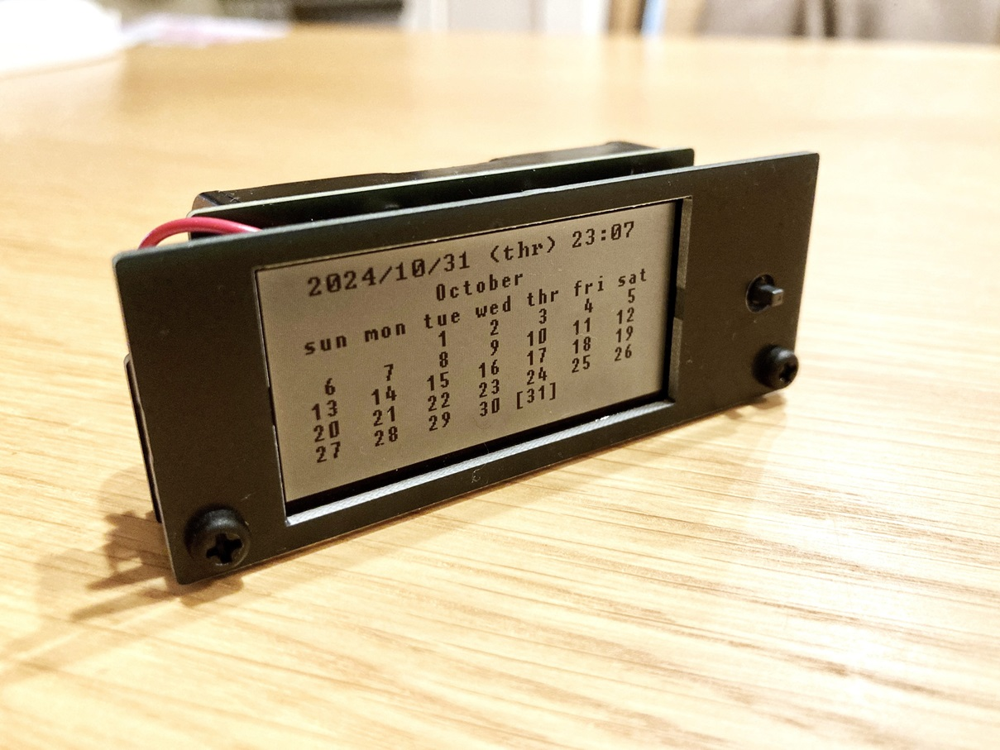
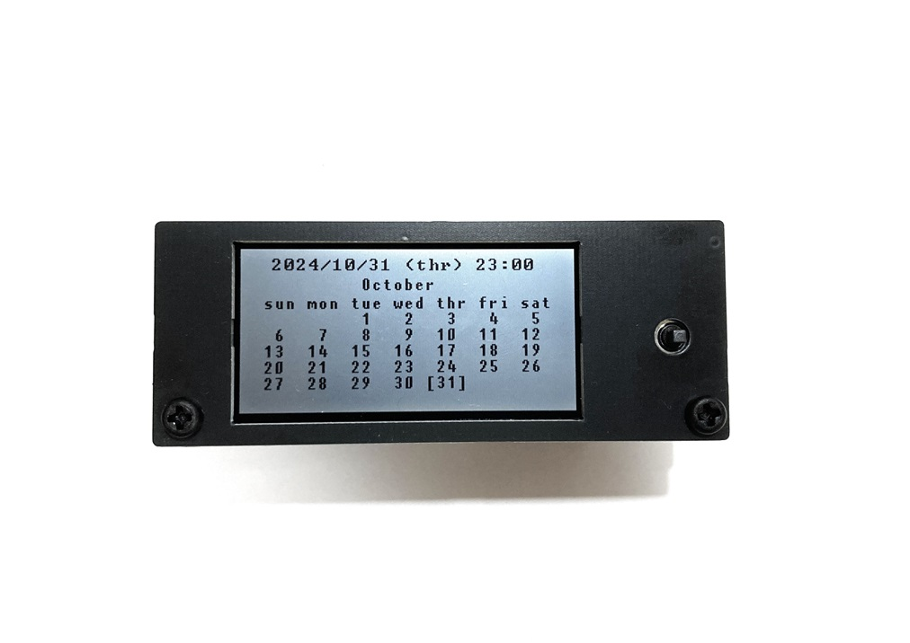
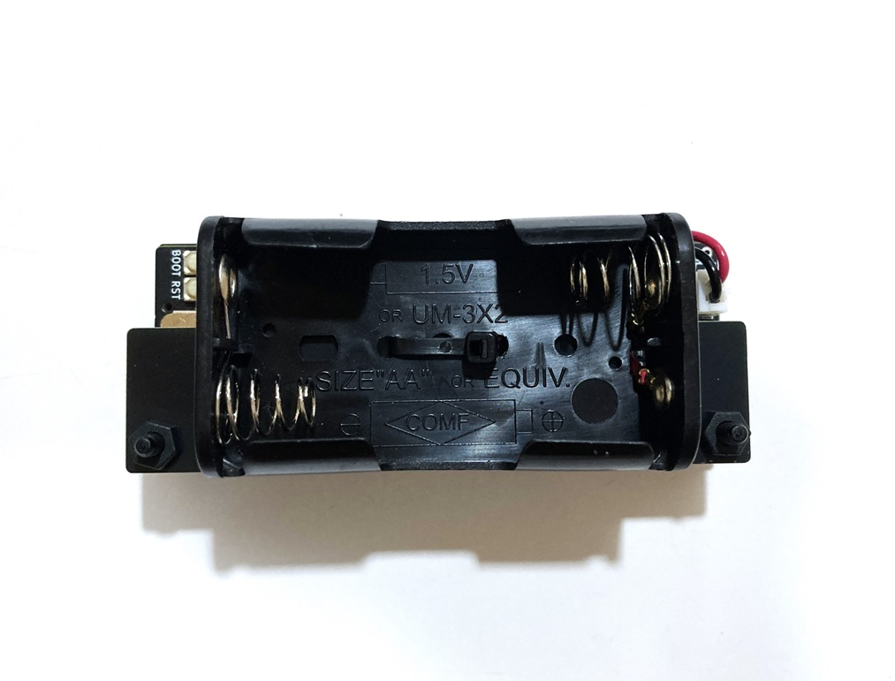

# 万年カレンダーユニット　Perpetual Calendar Unit

## 概要 
  * 2.13インチ、122x250 LCDを用いた万年カレンダーユニットです  
  * 現在の日付、時刻、その月を表示します  
  * 精度±3.8ppmの温度補正機能付RTC SD3077を搭載しています  
  * LCD横のジョイスティックで翌月や前月等、表示月を変更することが可能です  
  * 単三電池2本で約1年前後の電池寿命です  
  * Pico-SDKを使用したソースコードを公開しています  
 

## 仕様  
  * ジョイスティック(カレンダー切替、時刻合わせ)、BOOTボタン、RESETボタンを搭載しています  
  * マイコンRP2040、RTC SD3077、電源管理IC XC6194を使用しています  
  * RTCのINT信号によって電源管理ICからマイコンを1分に1回、起動させています  
  * 起動後はLCD表示を更新後、シャットダウン信号を電源管理ICに送って、マイコンの電源を切ることで省電力化しています    
  * RTCのINTとジョイスティックの中央ボタンは同一信号となっており、ユーザ操作の長押しによって復帰します  
  * 単三電池2本もしくはUSB電源(USB Type-C)  
  * 時刻(RTC)保持電池 CR1220  
  * サイズ82mm x32mm x 30mm(突起部、USBコネクタ除く)

## 注意点
  * LCDはガラス製のため、強い力や衝撃を与えると破損する可能性があります     
  * 使用時はクリップ等の金属がユニット内に入り込まないように注意してください  
  * 電池寿命は使用環境や使用方法によって大きく変動するため、期間を保証するものではありません  
  * 操作時はジョイスティックの中央を3秒程度長押しして、スリープから復帰させてください  
  * ジョイスティックの応答がない場合は背面のRSTボタンを押してください  
  * 万一、画面端に点表示が残る場合はカレンダー切替等で画面を数回リフレッシュすることで解消します  
  * 告知なしに部品や仕様を変更する場合があります  
  
## 使い方  

### a.通常使用の場合  
 単三電池2個もしくはUSB Type-CをUSB電源等に接続してください  
 画面がすぐに表示されない場合はLCD右横のジョイスティックの中央を3秒程度長押ししてください  
 万一、画面端に点表示が残る場合はb.カレンダー切替等で何度か画面をリフレッシュすることで解消します  

### b.カレンダー切替  
 カレンダーを翌月や前月に切り替える場合はジョイスティックの中央を3秒程度長押しして、スリープから復帰させてください  
 スリープから復帰すると画面が一瞬、点滅してLCDが再度、更新されます  
 この状態でジョイスティックを上下に動かすと表示月を切り替えることが可能です  
 10秒以上放置するか、ジョイスティックの中央を再度、押すと現在の月に戻ります  
 万一、ジョイスティックの応答がない場合は背面のRSTボタンを押してください  
　
### c.日付時刻合わせ  
 ジョイスティックの中央を3秒程度長押しして、スリープから復帰させてください  
 スリープから復帰すると画面が一瞬、点滅してLCDが再度、更新されます  
 この状態でジョイスティックを左右どちらかに3秒程度長押しすると日付、時刻合わせモードに入ります  
 左右で設定項目変更、上下で数値を変更します  
 決定する場合ははジョイスティックの中央を押して設定を完了させます  
 万一、ジョイスティックの応答がない場合は背面のRSTボタンを押してください  
 
   
### d.ファームウェアの書換を行う場合
 PC等にUSB Type-Cを接続し、BOOTボタンを押した状態でRSTボタンを押すとUSBドライブとして認識されます  
 ファームウェアファイル(*.uf2)を認識されたUSBドライブに書き込むことでファームの書換が可能です  

## 電池交換時の確認
  * RTC電池は電源供給なしで3年以上、日時、時刻を保持することが可能です  
  * 万一、保持できなくなった場合はCR1220の電池交換を行ってください  
  * 電池交換後は日時、時刻が不定値となるため、必ず時刻、日付を再設定してください  

## 外観

